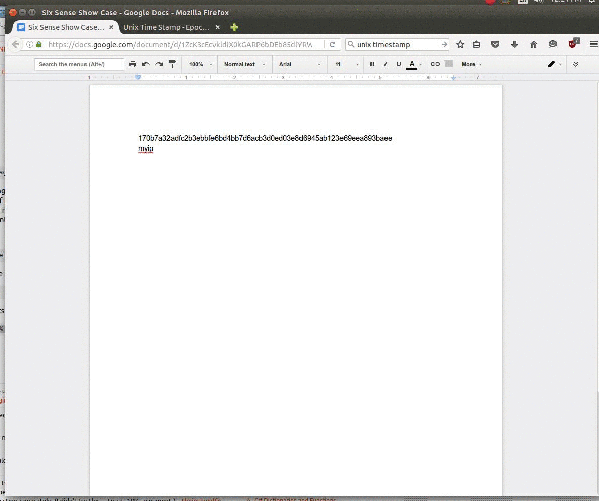

## Sixth Sense on Linux - Clipboard Magic
Right click the mouse (or ctrl + c), copy the text. MAGIC



### Installtion

```bash
make install
```

### Usage

```
python main.py
```

### Modules

1.  Translate English to Chinese

2.  Find public IP address

3.  Find URL title and check security risk with Google SafeBrowsing

4.  Use Virus Total api to check if SHA-256 is potentially malicious
